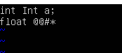
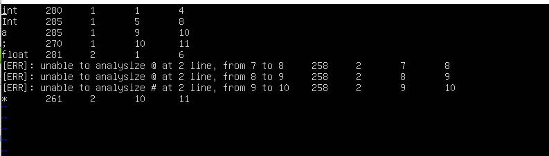

# lab1实验报告
学号 PB18000359  姓名 柳文浩
## 实验要求

实验要求根据cminus-f（追加浮点操作的C MINUS）的词法，补全给出的lexical_analyzer.l文件，对于从文件中的输入，能识别出其中的token，并对每个token输出其类型、出现的行数、起始位置和结束位置到输出文件中。

## 实验难点

1. FLEX的格式理解和应用，弄清楚.l文件各部分的格式和作用
2. 对于各种token类型的正则表达式的书写，需要转义的符号等
3. 助教给出的需要补全的文件的理解，包括从main函数中推断程序思路，分析analyzer函数等
4. 对于多行注释，需要特殊处理行数和最后一行结束的位置

## 实验设计

```c
COMMENT \/\*(?:[^\*]|\*+[^\/\*])*\*+\/
BLANK ([ ]|\t)+
EOL \n
LETTER [a-zA-Z]
ID [a-zA-Z]+
INTEGER [0-9]+
FLOAT ([0-9]+\.|[0-9]*\.[0-9]+)
ARRAY \[\]
```

以上是用到的几种token类型的正则式，COMMENT匹配不嵌套的注释，中间可以有包括\n的字符；BLANK匹配空格和制表符，EOL匹配换行符，ID匹配标识符，INTEGER和FLOAT分别匹配整数和浮点数，ARRAY匹配连续的[]符号。

```c
{COMMENT} {
           return COMMENT;
           }
{BLANK} {
        pos_start = pos_end;
        pos_end += strlen(yytext);
        return BLANK;
        }
{EOL}   {
        lines++;
		pos_start = 1;
		pos_end = 1;
        return EOL;
        }
"+"     {pos_start = pos_end;
        pos_end += strlen(yytext);
        return ADD;
        }
"-"    {pos_start = pos_end;
        pos_end += strlen(yytext);
        return SUB;
        }
"*"     {pos_start = pos_end;
        pos_end += strlen(yytext);
        return MUL;
        }
"/"     {pos_start = pos_end;
        pos_end += 1;
        return DIV;
        }
"<"    {pos_start = pos_end;
        pos_end += strlen(yytext);
        return LT;
        }
"<="    {pos_start = pos_end;
        pos_end += strlen(yytext);
        return LTE;
        }
">"     {pos_start = pos_end;
        pos_end += strlen(yytext);
        return GT;
        }
">="    {pos_start = pos_end;
        pos_end += strlen(yytext);
        return GTE;
        }
"=="    {pos_start = pos_end;
        pos_end += strlen(yytext);
        return EQ;
        }
"!="    {pos_start = pos_end;
        pos_end += strlen(yytext);
        return NEQ;
        }
"="       {pos_start = pos_end;
        pos_end += strlen(yytext);
        return ASSIN;
        }
";"       {pos_start = pos_end;
        pos_end += strlen(yytext);
        return SEMICOLON;
        }
","       {pos_start = pos_end;
        pos_end += strlen(yytext);
        return COMMA;
        }
"("      {pos_start = pos_end;
        pos_end += strlen(yytext);
        return LPARENTHESE;
        }
")"      {pos_start = pos_end;
        pos_end += strlen(yytext);
        return RPARENTHESE;
        }
"["      {pos_start = pos_end;
        pos_end += strlen(yytext);
        return LBRACKET;
        }
"]"      {pos_start = pos_end;
        pos_end += strlen(yytext);
        return RBRACKET;
        }
"{"      {pos_start = pos_end;
        pos_end += strlen(yytext);
        return LBRACE;
        }
"}"      {pos_start = pos_end;
        pos_end += strlen(yytext);
        return RBRACE;
        }
else    {pos_start = pos_end;
        pos_end += strlen(yytext);
        return ELSE;
        }
if      {pos_start = pos_end;
        pos_end += strlen(yytext);
        return IF;
        }
int     {pos_start = pos_end;
        pos_end += strlen(yytext);
        return INT;
        }
float   {pos_start = pos_end;
        pos_end += strlen(yytext);
        return FLOAT;
        }
return  {pos_start = pos_end;
        pos_end += strlen(yytext);
        return RETURN;
        }
void    {pos_start = pos_end;
        pos_end += strlen(yytext);
        return VOID;
        }
while   {pos_start = pos_end;
        pos_end += strlen(yytext);
        return WHILE;
        }
{ID}      {pos_start = pos_end;
        pos_end += strlen(yytext);
        return IDENTIFIER;
        }
{INTEGER} {pos_start = pos_end;
        pos_end += strlen(yytext);
        return INTEGER;
        }
{FLOAT}   {pos_start = pos_end;
        pos_end += strlen(yytext);
        return FLOATPOINT;
        }
{ARRAY}   {pos_start = pos_end;
        pos_end += strlen(yytext);
        return ARRAY;
        }
. {pos_start = pos_end;
        pos_end += 1;
	return ERROR;}
```

以上是规则区，包含所有种类的token的正规定义，且后面跟上识别出这种token之后需要做的动作（得到正确的pos_start,pos_end 和lines，返回相应的token类型在后续函数中处理。）

```c
int find_sub_string(const char* str1,const char* str2)
{

    if(!strstr(str1,str2)) return 0;

    int num = 0;
    while(*str1)
    {
        if(strstr(str1,str2) != NULL)
            num++;      //判定为子字符串，次数加一
        else    break;
        str1 = strstr(str1,str2)+1;
 /*strstr返回子字符串开始位置，然后位置后移一位，重新判断*/
        for(*str1; *str1 !='\0'; str1++)
        {
            if(*str1 == *str2)
                break;
        }
    }
    return num;
}
```

定义的寻找某一字符串在另一个字符串中出现次数的函数，用来得到注释COMMENT中出现的\n的数量，以计算出正确的lines

```c
void analyzer(char* input_file, Token_Node* token_stream){
    lines = 1;
    pos_start = 1;
    pos_end = 1;
	int i = 1;
    if(!(yyin = fopen(input_file,"r"))){
        printf("[ERR] No input file\n");
        exit(1);
    }
    printf("[START]: Read from: %s\n", input_file);

    int token;
    int index = 0;

    while(token = yylex()){
        switch(token){
            case COMMENT:
                if(!find_sub_string(yytext,"\n")){
                    pos_end += strlen(yytext);
                }
				else {
					lines += find_sub_string(yytext,"\n");
					for(i = yyleng; yytext[i] != '\n'; i--);
					pos_end = yyleng - i;
					pos_start = pos_end;
				}
            case BLANK:
                //STUDENT TO DO
                break;
            case EOL:
                //STUDENT TO DO
                break;
            case ERROR:
                printf("[ERR]: unable to analysize %s at %d line, from %d to %d\n", yytext, lines, pos_start, pos_end);
            default :
                if (token == ERROR){
                    sprintf(token_stream[index].text, "[ERR]: unable to analysize %s at %d line, from %d to %d", yytext, lines, pos_start, pos_end);
                } else {
                    strcpy(token_stream[index].text, yytext);
                }
                token_stream[index].token = token;
                token_stream[index].lines = lines;
                token_stream[index].pos_start = pos_start;
                token_stream[index].pos_end = pos_end;
                index++;
                if (index >= MAX_NUM_TOKEN_NODE){
                    printf("%s has too many tokens (> %d)", input_file, MAX_NUM_TOKEN_NODE);
                    exit(1);
                }
        }
    }
    printf("[END]: Analysis completed.\n");
    return;
}
```

在analyzer函数中，补充了匹配到COMMENT时，需要针对注释中的换行符调整得到正确的lines pos_start和pos_end，对于BLANK ERROR和EOL，已经在规则区中定义了行为，故不需要处理

## 实验结果验证



第一个int为关键词，识别为280，第二个Int为identifier，识别为285，第二行中float为关键词，识别为281，后面的@@和#都是未定义字符，返回ERROR，识别为258.处理ERROR时同时计算了pos_start 和 pos_end指针的位置，所以后面的*得到的是正确的开始和结束位置。


## 实验反馈

本次实验难度适中，作为第一个实验让我们很好的熟悉了实验环境和flex等工具的用法，对正则表达式也有了更深入的理解，对词法分析的工作机制也有了了解。


