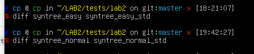
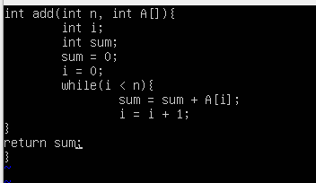
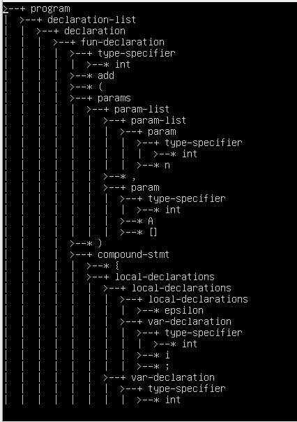
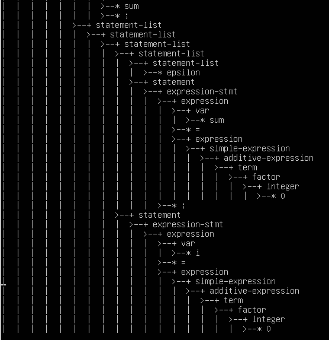
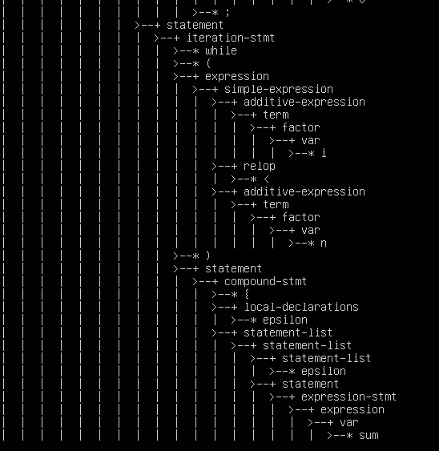
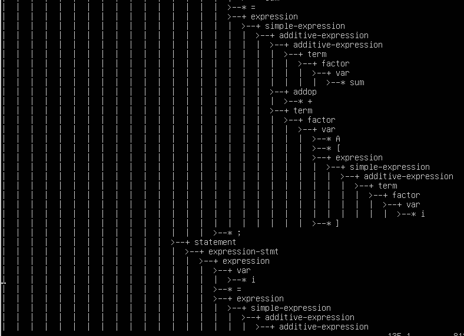
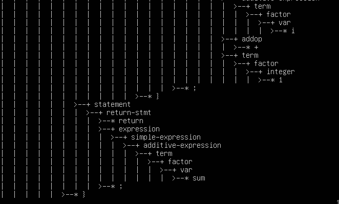

# lab2 实验报告
学号PB18000359 姓名 柳文浩
## 实验要求

利用flex和bison的协同工作构造C-minus-f语法分析器，并输出语法树

## 实验难点

1. 理解bison的书写格式和各部分的作用
2. 看懂SyntaxTree.c  SyntaxTree.h  syntax_analyzer.y等文件中已给出的函数的作用
3. 对每一条Cminus-f语法规则都写出正确的处理代码
4. 修改lexcial.l文件，弄清楚哪些token需要return给bison

## 实验设计

对lexcial_analyzer.l的修改举例：

```c
void pass_node(char *text){
     yylval.a = new_syntax_tree_node(text);
}//修改代码中结构体成员的名字，这是因为在syntax文件中定义的共用体的名字为a，需要对应


"-"    {pos_start = pos_end;
        pos_end += strlen(yytext);
		 pass_node(yytext);
        return SUB;
        }
"*"     {pos_start = pos_end;
        pos_end += strlen(yytext);
		 pass_node(yytext);
        return MUL;
        }
"/"     {pos_start = pos_end;
        pos_end += 1;
		 pass_node(yytext);
        return DIV;
        }//对于每个token修改lab1的代码，加入passnode函数传递给bison，其中COMMENT EOL等不在语法中出现
//的token不需要return和passnode

```

对syntax_analyzer.y的修改举例：

```c
%union {
	syntax_tree_node * a;
}//定义节点类型为syntax_tree_node *

%start program
%token <a> ADD SUB MUL DIV LT LTE GT GTE EQ NEQ ASSIN SEMICOLON COMMA LPARENTHESE RPARENTHESE 
LBRACKET RBRACKET LBRACE RBRACE ELSE IF INT FLOAT RETURN VOID WHILE  IDENTIFIER INTEGER FLOATPOINT  
ARRAY

%type <a>  program declaration-list  declaration  var-declaration  fun-declaration  type-specifier  params compound-stmt
param-list  param  local-declarations  statement-list statement expression-stmt selection-stmt iteration-stmt return-stmt
expression var simple-expression additive-expression addop term mulop factor integer float call args arg-list
relop //定义token和type


program : declaration-list { $$ = node("program", 1, $1); gt->root = $$; }
;
declaration-list:declaration-list declaration
{ $$ = node("declaration-list", 2, $1, $2);}
|declaration
{$$ = node("declaration-list", 1, $1);}
;//对每条语法规则写出对应的处理函数（助教提供的node函数可以十分方便的添加相应节点到语法树）
    
    
    
    
    
```


## 实验结果验证


diff指令结果为产生的语法树通过了助教给的全部easy和normal样例。

我的测试样例：



结果：












## 实验反馈

本次实验难度适中，复制语法规则时比较繁琐，而且直接复制会产生空格非法字符的问题，消耗了不少时间

深入了解语法分析的同时也锻炼了linux编程和常用指令的熟练度。